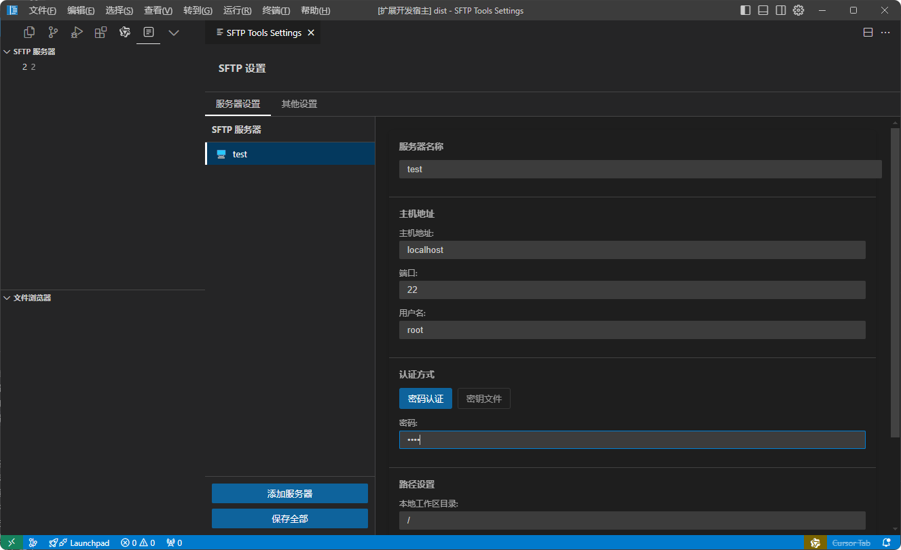
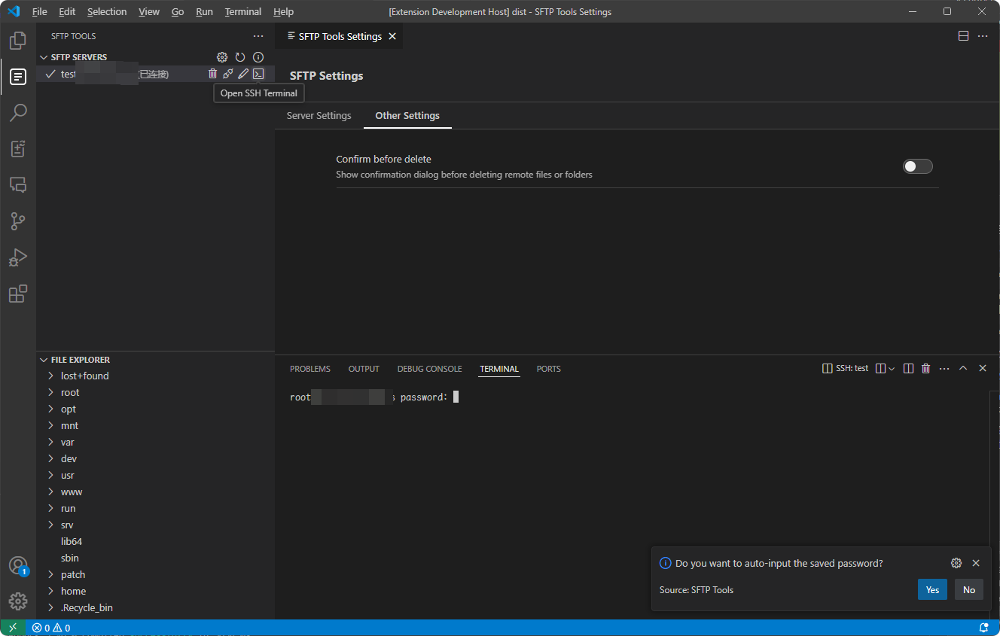
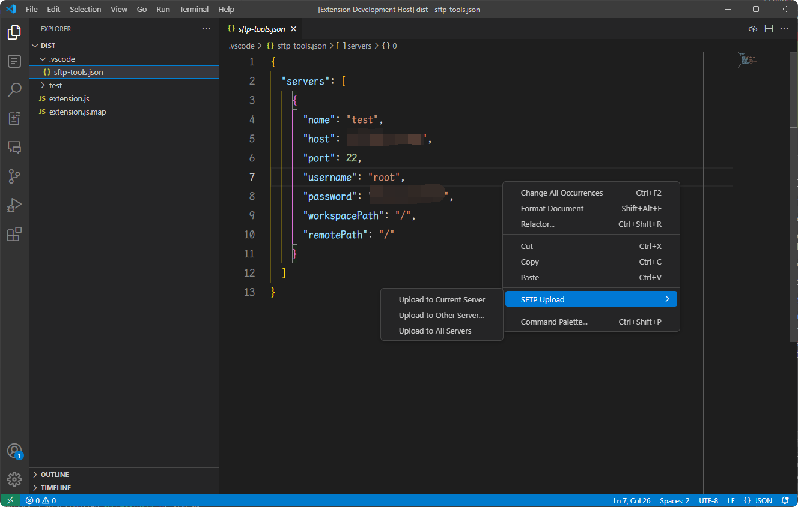
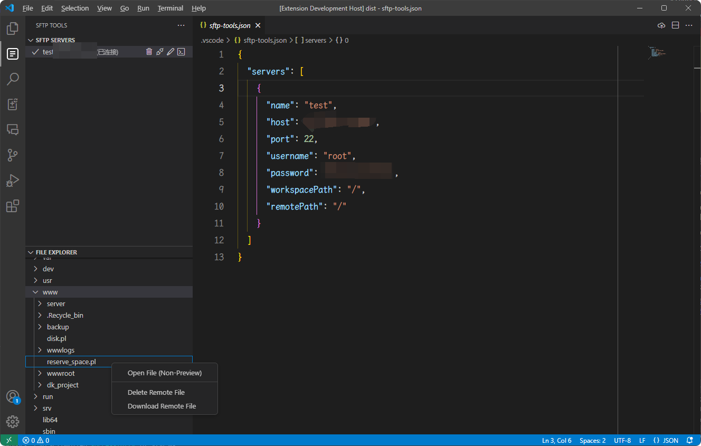

# SFTP Tools

English | [简体中文](README.md)

SFTP Tools is a VS Code extension for managing remote server files.

Install address: https://marketplace.visualstudio.com/items?itemName=caoayu.sftp-tools

## Features

- 📁 Remote file browsing
- 📝 File editing and saving
- 🔄 Automatic upload
- 🔒 Password and key authentication support
- 📋 Multi-server management
- 🖥️ One-click SSH connection
- 😊 Support backup

## Usage

1. Find SFTP Tools in the sidebar
2. Click "+" to add a server
3. Fill in server information
4. Connect and start using

## Configuration

For detailed configuration instructions, please refer to [CHANGELOG_EN.md](CHANGELOG_EN.md)

## Changelog

See [CHANGELOG_EN.md](CHANGELOG_EN.md)

## License

MIT License

Copyright (c) 2025 ayuayue

## Support Author

If you think this extension is helpful, you can buy a cup of coffee to support the author to continue development.

